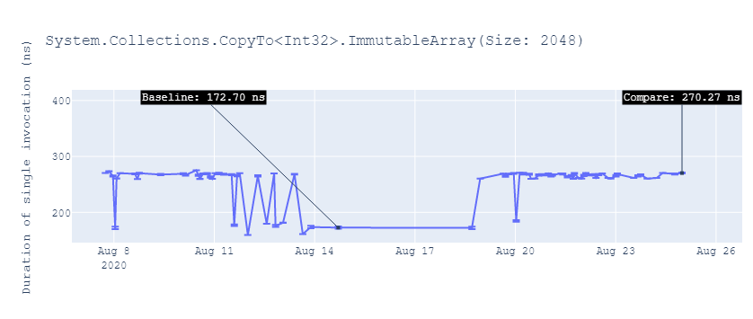

# Investigating regressions reported in the [dotnet/runtime](https://github.com/dotnet/runtime) repository

## Table of Contents

- [Introduction](#Introduction)
- [Repro](#Repro)
- [Disassembly](#Disassembly)
  - [DisassemblyDiagnoser](#DisassemblyDiagnoser)
  - [JitDump](#JitDump)
    - [InProcessToolchain](#InProcessToolchain)
    - [CoreRunToolchain](#CoreRunToolchain)
  - [Analysis](#Analysis)

# Introduction

**This doc explains how to investigate regressions reported in the [dotnet/runtime](https://github.com/dotnet/runtime) repository and it's targetted at [dotnet/runtime](https://github.com/dotnet/runtime) repository contributors.**

Before you start any performance investigation, you need to open the issue with regression report, click on the link that leads to the full historical data, and evaluate the data.

In most of the cases, it's obvious that there is a regression (see the [example](https://github.com/DrewScoggins/performance-2/issues/910) below) and you just continue to the [next step](#Repro).


But some benchmarks are multimodal (bimodal in the examples below [1](https://github.com/DrewScoggins/performance-2/issues/1683), [2](https://github.com/DrewScoggins/performance-2/issues/1379), [3](https://github.com/DrewScoggins/performance-2/issues/1378)) and there is no regression:




**If the historical data shows that there is no regression, you can just close the issue and provide a comment with an explanation**.
The more mature the system becomes, the less frequent false positives should be.

Some benchmarks can be unstable like in [this example](https://github.com/DrewScoggins/performance-2/issues/759):


If the benchmark is unstable and it measures something from an area that you [own](https://github.com/dotnet/runtime/blob/master/docs/area-owners.md), you should investigate why it's unstable and most probably rewrite it.

**You own the area, you own it's benchmarks ;)**

Last but not least, it might not be clear whether there is a regression or not, like in the following [example](https://github.com/DrewScoggins/performance-2/issues/1253):


Is such cases, you should estimate how important could be such a regression and decide whether you want to investigate it or not. You should always focus on the obvious regressions first, as they are very often caused by a problem that affects many other benchmarks. Fixing it might simply close few issues at once.

# Repro

The next step is to reproduce the regression locally. The most convenient way to do it is by using the [benchmarks_ci.py](../scripts/benchmarks_ci.py)
 script with the arguments provided in the reported issue.
 
 
```cmd
git clone https://github.com/dotnet/performance.git
# For Windows
py .\performance\scripts\benchmarks_ci.py -f netcoreappX netcoreappY --filter '$yourFilter*'
# For Unix systems
python3 ./performance/scripts/benchmarks_ci.py -f netcoreappX netcoreappY --filter '$yourFilter*'
```

The script downloads the latest .NET SDK for given framework moniker(s) and runs the benchmark(s) that match the provided filter. You can read more about filtering [here](benchmarkdotnet.md#Filtering-the-Benchmarks).

Few important things:

* [python 3.5](prerequisites.md) or newer needs to be installed and added to `PATH`.
* The script ignores the current environment variables and starts the process with no environment variables.
* By default, the `x64` architecture is used. If the issue mentions a different architecture, you need to provide it in an explicit way via `--architecture arm64|arm|x86`.
* On Unix systems, you need to:
  * use python**3** in an explicit way. Otherwise, you might get a very vague syntax error from python **2**.
  * escape the asterisks provided to the filter `'*'`. If you don't, the OS is going to replace `*` with the names of files in your current folder and you won't run any benchmarks.

If you can't reproduce the problem locally, you need to double-check that you are using the exact same architecture and OS.

If you've ensured that you are using the right config and you still can't repo the problem, you should diff the disassembly. If there is no difference, you can close the issue. Please don't forget to include the exported disassembly 

# Disassembly

Using the disassembly can be very useful for nano-benchmarks (time reported by BenchmarkDotNet is less than one microsecond). But before we take a look at some `ASM`, let's find out how to get disassembly first.

## DisassemblyDiagnoser

BenchmarkDotNet has a built-in disassembler called [DisassemblyDiagnoser](https://adamsitnik.com/Disassembly-Diagnoser/). You can read more about it [here](benchmarkdotnet.md#Disassembly).

It supports Windows (both `x64` and `x86`) and Linux `x64`. ARM64 and ARM are not supported ([yet](https://github.com/dotnet/BenchmarkDotNet/issues/1422#issuecomment-691036956)). Internally it uses [ClrMD](https://github.com/Microsoft/clrmd) to get a byte representation of the disassembly (`byte[]`) and [Iced](https://github.com/0xd4d/iced) to turn it into a human-readable text (`string`). It disassembles the code after the benchmarks are executed, so it does not add any overhead to the reported results.

To get the disassembly, you just need to pass `--disasm` or just `-d` to `dotnet cli`.

This particular disassembler is recursive, and you can control the depth via `--disasmDepth` argument. By default it's set to `1` so it disassembles just the benchmark code itself.

The [benchmarks_ci.py](../scripts/benchmarks_ci.py) script exposes some BDN arguments, but not all of them. Those which are not exposed by the python script needs to be passed via `--bdn-arguments` argument as **pairs of strings**.

Example:

```cmd
benchmarks_ci.py --bdn-arguments "--disasm true disasmDepth 3"
```

**Note:** By default, the `DisassemblyDiagnoser` does not show the **addresses of the instructions**. It's possible to enable it, but only from the [code level](../src/harness/BenchmarkDotNet.Extensions/RecommendedConfig.cs):

```cs
.AddDiagnoser(new DisassemblyDiagnoser(new DisassemblyDiagnoserConfig(printInstructionAddresses: true)))
```

## JitDump

JitDump is the most powerfull .NET Core disassembler. It's also the only disassembler that supports all architectures and indirect method calls. It has an [excellent documentation](https://github.com/dotnet/runtime/blob/master/docs/design/coreclr/jit/viewing-jit-dumps.md) that describes how to use it when working with **standalone** .NET applications.

There are two ways of using it with BenchmarkDotNet.

### CoreRunToolchain

When working with local builds of .NET Core it's [recommended](benchmarking-workflow-dotnet-runtime.md) to use [CoreRun](benchmarkdotnet.md#CoreRun) to run the benchmarks against a local build of .NET Core.

To combine the powers of `ClrJit`, `CoreRun` and `BenchmarkDotNet` you need to copy a `checked` version of `clrjit.dll` into `Release` CoreRun's folder (**Checked -> Release**):

```cmd
copy /y ".\runtime\artifacts\bin\coreclr\Windows_NT.x64.Checked\clrjit.dll" \\
 ".\runtime\artifacts\bin\testhost\net5.0-Windows_NT-Release-x64\shared\Microsoft.NETCore.App\6.0.0\"
```

**Note:** You might need to do it every time after you rebuild the product.

And then tell BenchmarkDotNet to use it to run the benchmarks with appropriate environment variables:

```cmd
py .\performance\scripts\benchmarks_ci.py -f netcoreapp5.0 \\
--corerun .\runtime\artifacts\bin\testhost\net5.0-Windows_NT-Release-x64\shared\Microsoft.NETCore.App\6.0.0\CoreRun.exe 
--bdn-arguments "--envVars COMPlus_JitDump:$value"
--filter $yourFilter
--dotnet-compilation-mode NoTiering
```

**Note:** to disable Tiered JIT (otherwise you get Tier 0 code) you need tp pass `--dotnet-compilation-mode NoTiering` to the python script (or the right thing to `--envVars`).

**Note:** The filter accepted by `COMPlus_JitDump` uses `:` (colon) to separate type and method names. The filter accepted by BDN uses dots only.

```cmd
--filter Burgers.Test0
--envVars COMPlus_JitDump:Burgers:Test0
```

### InProcessToolchain

By default BenchmarkDotNet runs every benchmark in a standalone process. But it's possible to run the benchmarks in the same process. As long as they don't have any side-effects (allocating memory, creating threads etc) it *should be fine*.

* follow the steps described [here](https://github.com/dotnet/runtime/blob/master/docs/design/coreclr/jit/viewing-jit-dumps.md#setting-up-our-environment) for [MicroBenchmarks.csproj](../src/benchmarks/micro/MicroBenchmarks.csproj) project
* the [src/benchmarks/micro](../src/benchmarks/micro/) folder contains a solution file and a project file named `MicroBenchmarks`. To publish a self-contained version of the project you need to specify the **path to project file** in explicit way. If you don't it's going to try to publish all projects from the [solution file](../src/benchmarks/micro/MicroBenchmarks.sln) and fail!

```cmd
# make sure that the local copy of dotnet is used (not the default version from your PATH)
set DOTNET_MULTILEVEL_LOOKUP=0
# publish a self-contained version in Release using dotnet downloaded by the python script
.\performance\tools\dotnet\x64\dotnet.exe publish .\performance\src\benchmarks\micro\MicroBenchmarks.csproj \\
 -c Release -f netcoreapp5.0 --self-contained -r win-x64
# copy the files
robocopy /e .\runtime\artifacts\bin\coreclr\Windows_NT.x64.Release .\performance\artifacts\bin\MicroBenchmarks\Release\netcoreapp5.0\win-x64\publish
# copy a checked version of "clrjit.dll" (the most important file)
copy /y .\runtime\artifacts\bin\coreclr\Windows_NT.x64.Checked\clrjit.dll .\performance\artifacts\bin\MicroBenchmarks\Release\netcoreapp5.0\win-x64\publish\
```

* and when running a self-contained version of `MicroBenchmarks` app force BenchmarkDotNet to use the [InProcessToolchain](https://benchmarkdotnet.org/articles/configs/toolchains.html#sample-introinprocess) by passing `--inProcess` or just `-i`.

```cmd
# set the COMPlus_JitDump env var to filter the disasm
set COMPlus_JitDump=namespace.typeName:methoName

.\performance\artifacts\bin\MicroBenchmarks\Release\netcoreapp5.0\win-x64\publish\MicroBenchmarks.exe \\ 
 --inProcess \\
 --filter namespace.typeName.methodName
```


## Analysis

Analyzing the assembly code is a non-trivial skill and the goal of this doc is definitely not to try to teach you that. There are some common recurring patterns and we are going to focus only on these.

### The managed implementation was changed and the produced assembly code has changed as well

If the C# source code became:

* more complex to solve a different problem (like added a few `if` statements to fix a bug):
  * if it's an important code path you should optimize it or ask for help if you don't know how to do it (**it's perfectly fine to not know all C# perf tricks!!**).
  * if it can not be optimized or it's not worth it, you should close the issue and explain why it's a by-design regression.
* simpler, but the produced assembly code has gotten worse you should label the issue as `area-CodeGen-coreclr` and tag @dotnet/jit-contrib to get help. Depending on the complexity of the problem and the judgment of the JIT Team the problem might get fixed on the JIT side or given change might be simply reverted.

### The managed implementation was **not** changed, but the produced assembly code has changed

It's most probably caused by changes in the JIT. You should label the issue as `area-CodeGen-coreclr` and tag @dotnet/jit-contrib to get help.

An [example](https://github.com/dotnet/runtime/issues/41738) of such issue where `System.Numerics.Quaternion.Conjugate(System.Numerics.Quaternion)` stopped being inlined:

<table>
<tr>
<th>
.NET Core 3.1.6
</th>
<th>
.NET Core 5.0.20.41714
</th>
</tr>
<tr>
<td style="vertical-align: top">
<pre>
; System.Numerics.Tests.Perf_Quaternion.ConjugateBenchmark()
       sub       rsp,18
       vzeroupper
       lea       rax,[rsp+8]
       vxorps    xmm0,xmm0,xmm0
       vmovss    dword ptr [rax],xmm0
       vmovss    dword ptr [rax+4],xmm0
       vmovss    dword ptr [rax+8],xmm0
       vmovss    xmm0,dword ptr [7FFF277E5718]
       vmovss    dword ptr [rax+0C],xmm0
       lea       rax,[rsp+8]
       vmovss    xmm0,dword ptr [rax]
       vmovss    xmm1,dword ptr [rax+4]
       vmovss    xmm2,dword ptr [rax+8]
       vmovss    xmm3,dword ptr [rax+0C]
       vmovss    xmm4,dword ptr [7FFF277E571C]
       vxorps    xmm0,xmm0,xmm4
       vmovss    xmm4,dword ptr [7FFF277E571C]
       vxorps    xmm1,xmm1,xmm4
       vmovss    xmm4,dword ptr [7FFF277E571C]
       vxorps    xmm2,xmm2,xmm4
       vmovss    dword ptr [rdx],xmm0
       vmovss    dword ptr [rdx+4],xmm1
       vmovss    dword ptr [rdx+8],xmm2
       vmovss    dword ptr [rdx+0C],xmm3
       mov       rax,rdx
       add       rsp,18
       ret
; Total bytes of code 130
</pre>
</td>
<td style="vertical-align: top">
<pre>
; System.Numerics.Tests.Perf_Quaternion.ConjugateBenchmark()
       push      rsi
       sub       rsp,40
       vzeroupper
       mov       rsi,rdx
       lea       rcx,[rsp+30]
       vxorps    xmm0,xmm0,xmm0
       vmovss    dword ptr [rcx],xmm0
       vmovss    dword ptr [rcx+4],xmm0
       vmovss    dword ptr [rcx+8],xmm0
       vmovss    xmm0,dword ptr [7FFF3AEB4610]
       vmovss    dword ptr [rcx+0C],xmm0
       mov       rcx,rsi
       vmovupd   xmm0,[rsp+30]
       vmovupd   [rsp+20],xmm0
       lea       rdx,[rsp+20]
       call      System.Numerics.Quaternion.Conjugate(System.Numerics.Quaternion)
       mov       rax,rsi
       add       rsp,40
       pop       rsi
       ret
; Total bytes of code 81
</pre>
<pre>
; System.Numerics.Quaternion.Conjugate(System.Numerics.Quaternion)
       vzeroupper
       vmovss    xmm0,dword ptr [rdx]
       vmovss    xmm1,dword ptr [7FFF3AEB46E0]
       vxorps    xmm0,xmm0,xmm1
       vmovss    xmm1,dword ptr [rdx+4]
       vmovss    xmm2,dword ptr [7FFF3AEB46E0]
       vxorps    xmm1,xmm1,xmm2
       vmovss    xmm2,dword ptr [rdx+8]
       vmovss    xmm3,dword ptr [7FFF3AEB46E0]
       vxorps    xmm2,xmm2,xmm3
       vmovss    xmm3,dword ptr [rdx+0C]
       vmovss    dword ptr [rcx],xmm0
       vmovss    dword ptr [rcx+4],xmm1
       vmovss    dword ptr [rcx+8],xmm2
       vmovss    dword ptr [rcx+0C],xmm3
       mov       rax,rcx
       ret
; Total bytes of code 81
</pre>
</td>
</tr>
</table>

### The generated assembly code has not changed, but the performance has regressed

This is possible and happens more frequently than we would like to ;) It's typically caused by the alignment changes.

#### Memory Alignment

If given benchmark is using arrays (or any other continious segments of memory) and they are being iterated over and over it's likely that you are facing a memory alignment issue.

In https://github.com/dotnet/runtime/issues/37814 @jkotas has [provided](https://github.com/dotnet/runtime/issues/37814#issuecomment-667804880) a small repro that shows *"the many modal nature of memory copying"*:

```cs
using System;
using System.Diagnostics;

class Program
{
    static void Work(ReadOnlySpan<string> from, Span<string> to)
    {
        for (int i = 0; i < 1000000; i++) from.CopyTo(to);
    }

    static void Main(string[] args)
    {
        Random r = new Random();
        for (;;)
        {
            var sw = new Stopwatch();
            GC.KeepAlive(new byte[r.Next(32)]); // the trick
            var from = new string[2048];
            GC.KeepAlive(new byte[r.Next(32)]);
            var to = new string[2048];
            if (r.Next(10) == 0) GC.Collect();
            sw.Start();
            Work(from, to);       
            sw.Stop();
            Console.WriteLine(sw.ElapsedMilliseconds);
        }
    }
}
```

In this particular example using my machine I am getting values oscilating between ~430 and ~630 ms.

The best thing you can do is to **make sure that the produced assembly code has not changed and just close the issue**. If you want to be 100% sure you can handcraft a modified version of the benchmark that allocates an aligned array, pins it and reuses for all benchmarking iterations. If you want to go deeper than that, you need to use a specialized profiler like [VTune](profiling-workflow-dotnet-runtime.md#VTune) or [uProf](profiling-workflow-dotnet-runtime.md#uProf).

<details>

```cs
private static T[] AllocateAlignedArray<T>(int size, out GCHandle pinnedArrayHandle)
{
    while (true)
    {
        T[] result = new T[size];
        pinnedArrayHandle = GCHandle.Alloc(result, GCHandleType.Pinned);

        if ((long)pinnedArrayHandle.AddrOfPinnedObject() % 32 == 0)
        {
            return result;
        }
        else
        {
            pinnedArrayHandle.Free();
        }
    }
}
```

</details>


#### Code Alignment

